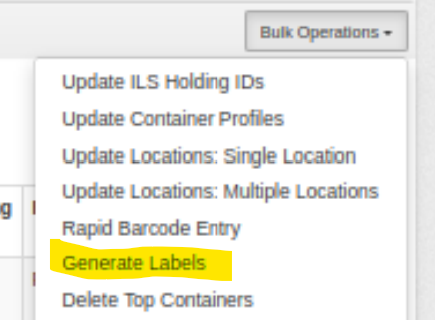
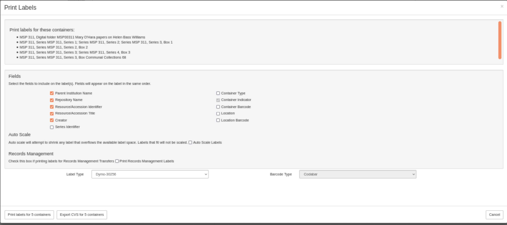
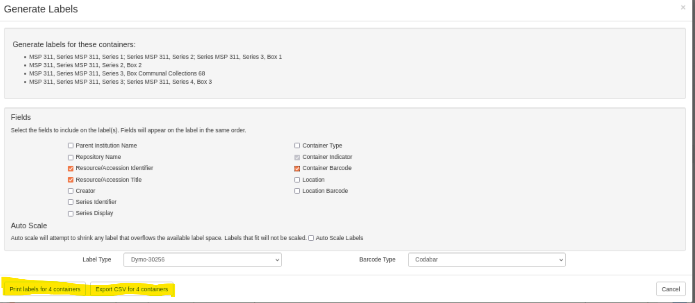
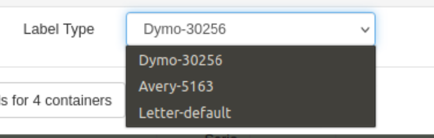

#How to Generate Labels

**Note** that, depending on the configuration chosen by your site, the images depicted here may be slightly different from what you see.

In order to use this feature, you must have permissions to manage top containers.

1. Select **Manage Top Containers** from the "gear" pulldown at the top right of the screen.

    You are then presented with a screen with variety of options to search for, and select, your target Top Containers.

2. Select the containers for which you want to generate labels.

3. Select **Generate Labels** from the **Bulk Operations** pulldown.  
  This will take you to the **Generate Labels** screen. 
  
4. Select the fields that you want to include on the labels.  Checkboxes that are "greyed out" indicate fields that your institution has decided should always appear on a label. 

5. If you are printing labels, rather than exporting a CSV file, select the label type.  
6. Click on either the **Print labels** or **Export CSV** button.
  Another browser window will be opened.  If you have selected **Print Labels**, the formatted labels will be displayed for you to print.  If you have selected **Export CSV**, the CSV will be available for download.
  


